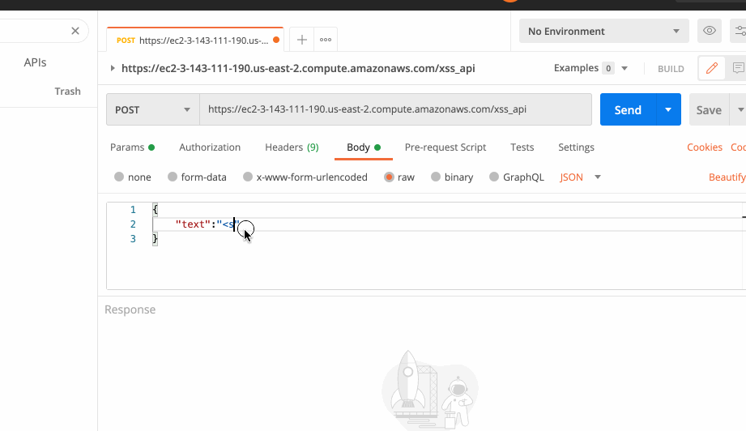
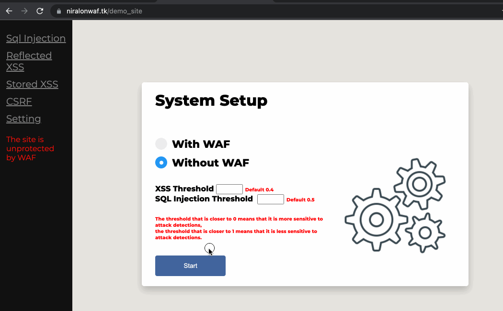
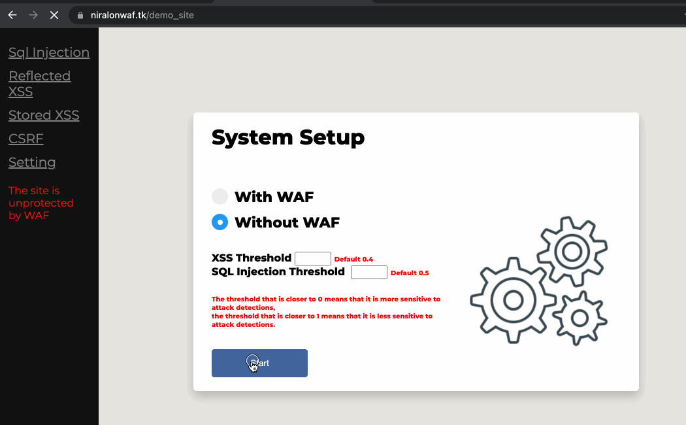

# Web Application Firewall (WAF) &copy;

***
### Summary 
WAF detects and prevents XSS, SQL injection, and CSRF cyberattacks on HTTP/S protocol.

The system activity and network traffic are shown in several ways:

∙ RESTAPI

∙ Web based log

WAF is based on deep learning algorithm (CNN) on TensorFlow. 

Deployed on AWS EC2 instance and response on REST API.
### WAF XSS AND SQL API TESTING:
###Prerequisites:
* Postman

https://ec2-3-143-111-190.us-east-2.compute.amazonaws.com/sql_api

{
"text":"enter sql injection code OR any other text"
}

https://ec2-3-143-111-190.us-east-2.compute.amazonaws.com/xss_api

{
"text":"enter xss code OR any other text"
}

### Link to the demo_site with WAF protection option : 
https://niralonwaf.tk/demo_site

##**HOW TO MAKE IT RUN?**

1. run pip install requirements.txt file
2. run python manage.py runserver

*Once your server is up go to  http://127.0.0.1:8000/demo_site*

3. Activate the models with docker:
* The models can be downloaded here : https://drive.google.com/file/d/1yvDGWF2v7DdcjaNwYqnGr7cprvjwjd89/view?usp=sharing
* With docker run this two commands and make sure you set the right **path on source**

Deploy SQL container

sudo docker run -p 8500:8501 --name tfserving_sql --mount type=bind,source=/home/ubuntu/DockerModels/sqlmodel,target=/models/sql -e MODEL_NAME=sql -t tensorflow/serving &

Deploy XSS container

sudo docker run -p 8501:8501 --name tfserving_xss --mount type=bind,source=/home/ubuntu/DockerModels/xssmodel,target=/models/xss -e MODEL_NAME=xss -t tensorflow/serving &

***
Once docker is up you can use the WAF protection for the demo_site.

#Hope you all enjoy from it.

